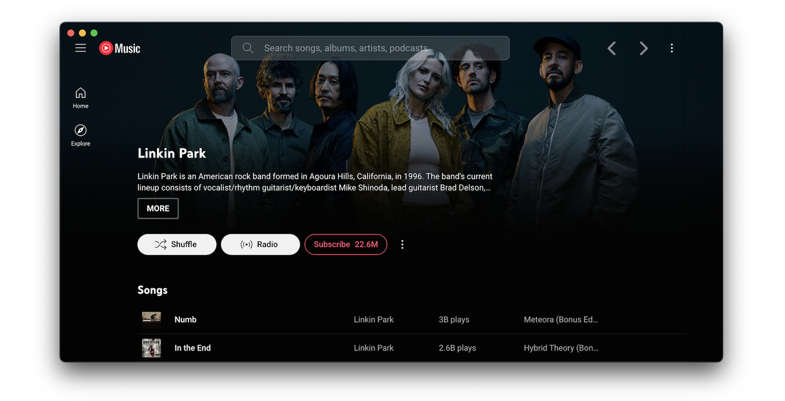

<div align="center" markdown="1">
   <sup>Special thanks to:</sup>
   <br>
   <br>
   <a href="https://go.warp.dev/pear-desktop">
      
   </a>

### [Warp, built for coding with multiple AI agents](https://go.warp.dev/pear-desktop)
[Available for macOS, Linux, & Windows](https://go.warp.dev/pear-desktop)<br>

</div>
<hr>

<div align="center">

# :pear: Pear Desktop

[](https://github.com/pear-devs/pear-desktop/releases/)
[](https://github.com/pear-devs/pear-desktop/blob/master/license)
[](https://github.com/pear-devs/pear-desktop/blob/master/eslint.config.mjs)
[](https://GitHub.com/pear-devs/pear-desktop/releases/)
[](https://GitHub.com/pear-devs/pear-desktop/releases/)
<!--[](https://aur.archlinux.org/packages/pear-desktop-bin)-->
[](https://snyk.io/test/github/pear-devs/pear-desktop)

</div>

<!---->

- Native look & feel extension

> [!IMPORTANT]
> ⚠️ Disclaimer
>
> **No Affiliation**
>
> This project, and its contributors, are not affiliated with, authorized by, endorsed by, or in any way officially connected with Google LLC, YouTube, or any of their subsidiaries or affiliates. **This is an independent, non-profit, and unofficial extension developed by a team of volunteers with the goal of providing a desktop experience.**
>
> **Trademarks**
>
> The names "Google" and "YouTube Music", as well as related names, marks, emblems, and images, are registered trademarks of their respective owners. Any use of these trademarks is for identification and reference purposes only and does not imply any association with the trademark holder. We have no intention of infringing upon these trademarks or causing harm to the trademark holders.
>
> **Limitation of Liability**
>
> This application (extension) is provided "AS IS", and you use it at your own risk. In no event shall the developers or contributors be liable for any claim, damages, or other liability, including any legal consequences, arising from, out of, or in connection with the software or the use or other dealings in the software. The responsibility for any and all outcomes of using this software rests entirely with the user.

## Content

- [Features](#features)
- [Translation](#translation)
- [Download](#download)
  - [Arch Linux](#arch-linux)
  - [Solus](#solus)
  - [MacOS](#macos)
  - [Windows](#windows)
    - [How to install without a network connection? (in Windows)](#how-to-install-without-a-network-connection-in-windows)
- [Themes](#themes)
- [Dev](#dev)
- [Build your own plugins](#build-your-own-plugins)
  - [Creating a plugin](#creating-a-plugin)
  - [Common use cases](#common-use-cases)
- [Build](#build)
- [Production Preview](#production-preview)
- [Tests](#tests)
- [License](#license)
- [FAQ](#faq)

## Translation

You can help with translation on [Hosted Weblate](https://bit.ly/48n5YF7).

<a href="https://bit.ly/48n5YF7">
  
  
</a>

## Download

You can check out the [latest release](https://github.com/pear-devs/pear-desktop/releases/latest) to quickly find the
latest version.

### Arch Linux

Install the [`pear-desktop`](https://aur.archlinux.org/packages/pear-desktop) package from the AUR. For AUR installation instructions, take a look at
this [wiki page](https://wiki.archlinux.org/index.php/Arch_User_Repository#Installing_packages).

### [Solus](https://getsol.us/)

```bash
sudo eopkg install pear-desktop
```

### macOS

You can install the app using Homebrew (see the [cask definition](https://github.com/pear-devs/homebrew-pear)):

```bash
brew install pear-devs/pear/pear-desktop
```

If you install the app manually and get an error "is damaged and can’t be opened." when launching the app, run the following in the Terminal:

```bash
/usr/bin/xattr -cr /Applications/Pear\ Desktop.app
```

### Windows

You can use the [Scoop package manager](https://scoop.sh) to install the `pear-desktop` package from
the [`extras` bucket](https://github.com/ScoopInstaller/Extras).

```bash
scoop bucket add extras
scoop install extras/pear-desktop
```

Alternately you can use [Winget](https://learn.microsoft.com/en-us/windows/package-manager/winget/), Windows 11s
official CLI package manager to install the `pear-devs.pear-desktop` package.

*Note: Microsoft Defender SmartScreen might block the installation since it is from an "unknown publisher". This is also
true for the manual installation when trying to run the executable(.exe) after a manual download here on github (same
file).*

```bash
winget install pear-devs.pear-desktop
```

#### How to install without a network connection? (in Windows)

- Download the `*.nsis.7z` file for _your device architecture_ in [release page](https://github.com/pear-devs/pear-desktop/releases/latest).
  - `x64` for 64-bit Windows
  - `ia32` for 32-bit Windows
  - `arm64` for ARM64 Windows
- Download installer in release page. (`*-Setup.exe`)
- Place them in the **same directory**.
- Run the installer.

## Themes

You can load CSS files to change the look of the application (Options > Visual Tweaks > Themes).

Some predefined themes are available in https://github.com/kerichdev/themes-for-ytmdesktop-player.

## Dev

```bash
git clone https://github.com/pear-devs/pear-desktop
cd pear-desktop
pnpm install --frozen-lockfile
pnpm dev
```

Instead of installing pnpm on your system, you can also use [devcontainers](https://containers.dev/). You can use devcontainers either as a development environment in VS Code, or as a way to easily build the project without installing dependencies on your host system.

Note that this has it's own limitations (for example, GUI doesn't work on, at least some, Linux hosts).

## Build your own plugins

Using plugins, you can:

- manipulate the app - the `BrowserWindow` from electron is passed to the plugin handler
- change the front by manipulating the HTML/CSS

### Creating a plugin

Create a folder in `src/plugins/YOUR-PLUGIN-NAME`:

- `index.ts`: the main file of the plugin
```typescript
import style from './style.css?inline'; // import style as inline

import { createPlugin } from '@/utils';

export default createPlugin({
  name: 'Plugin Label',
  restartNeeded: true, // if value is true, ytmusic show restart dialog
  config: {
    enabled: false,
  }, // your custom config
  stylesheets: [style], // your custom style,
  menu: async ({ getConfig, setConfig }) => {
    // All *Config methods are wrapped Promise<T>
    const config = await getConfig();
    return [
      {
        label: 'menu',
        submenu: [1, 2, 3].map((value) => ({
          label: `value ${value}`,
          type: 'radio',
          checked: config.value === value,
          click() {
            setConfig({ value });
          },
        })),
      },
    ];
  },
  backend: {
    start({ window, ipc }) {
      window.maximize();

      // you can communicate with renderer plugin
      ipc.handle('some-event', () => {
        return 'hello';
      });
    },
    // it fired when config changed
    onConfigChange(newConfig) { /* ... */ },
    // it fired when plugin disabled
    stop(context) { /* ... */ },
  },
  renderer: {
    async start(context) {
      console.log(await context.ipc.invoke('some-event'));
    },
    // Only renderer available hook
    onPlayerApiReady(api, context) {
      // set plugin config easily
      context.setConfig({ myConfig: api.getVolume() });
    },
    onConfigChange(newConfig) { /* ... */ },
    stop(_context) { /* ... */ },
  },
  preload: {
    async start({ getConfig }) {
      const config = await getConfig();
    },
    onConfigChange(newConfig) {},
    stop(_context) {},
  },
});
```

### Common use cases

- injecting custom CSS: create a `style.css` file in the same folder then:

```typescript
// index.ts
import style from './style.css?inline'; // import style as inline

import { createPlugin } from '@/utils';

export default createPlugin({
  name: 'Plugin Label',
  restartNeeded: true, // if value is true, pear-desktop will show a restart dialog
  config: {
    enabled: false,
  }, // your custom config
  stylesheets: [style], // your custom style
  renderer() {} // define renderer hook
});
```

- If you want to change the HTML:

```typescript
import { createPlugin } from '@/utils';

export default createPlugin({
  name: 'Plugin Label',
  restartNeeded: true, // if value is true, ytmusic will show the restart dialog
  config: {
    enabled: false,
  }, // your custom config
  renderer() {
    console.log('hello from renderer');
  } // define renderer hook
});
```

- communicating between the front and back: can be done using the ipcMain module from electron. See `index.ts` file and
  example in `sponsorblock` plugin.

## Build

1. Clone the repo
2. Follow [this guide](https://pnpm.io/installation) to install `pnpm`
3. Run `pnpm install --frozen-lockfile` to install dependencies
4. Run `pnpm build:OS`

- `pnpm dist:win` - Windows
- `pnpm dist:linux` - Linux (amd64)
- `pnpm dist:linux:deb-arm64` - Linux (arm64 for Debian)
- `pnpm dist:linux:rpm-arm64` - Linux (arm64 for Fedora)
- `pnpm dist:mac` - macOS (amd64)
- `pnpm dist:mac:arm64` - macOS (arm64)

Builds the app for macOS, Linux, and Windows,
using [electron-builder](https://github.com/electron-userland/electron-builder).

### Building in devcontainer

1. Clone the repo;
2. Open the folder in VS Code;
3. Reopen in container when prompted;
4. Run `pnpm build` as above (choosing the desired target);
5. Collect the built files from the `dist` folder.

Since devcontainer uses a mount for the workspace, the built files will be available on the host system as well.

## Production Preview

```bash
pnpm start
```

## Tests

```bash
pnpm test
```

Uses [Playwright](https://playwright.dev/) to test the app.

## License

MIT © [pear-devs](https://github.com/pear-devs/pear-desktop)

## FAQ

### Why apps menu isn't showing up?

If `Hide Menu` option is on - you can show the menu with the <kbd>alt</kbd> key (or <kbd>\`</kbd> [backtick] if using
the in-app-menu plugin)
